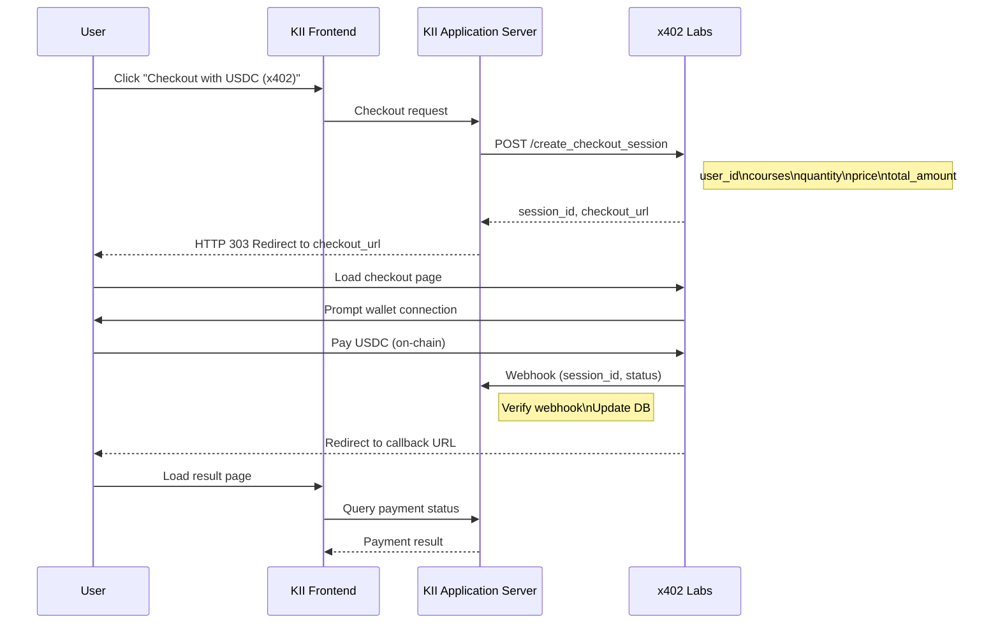
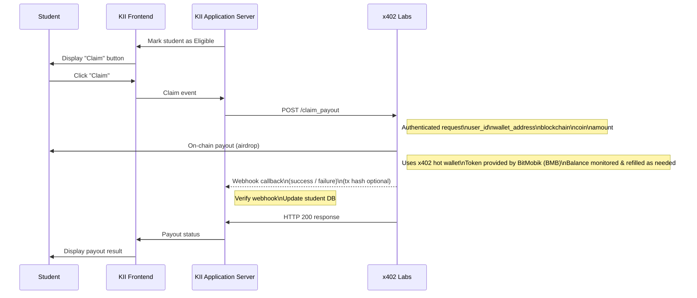

```mermaid
sequenceDiagram
    participant User
    participant KII_Frontend as KII Frontend
    participant KII_Server as KII Application Server
    participant X402 as x402 Labs

    User ->> KII_Frontend: Click "Checkout with USDC (x402)"
    KII_Frontend ->> KII_Server: Checkout request

    KII_Server ->> X402: POST /create_checkout_session
    Note right of X402: user_id\ncourses\nquantity\nprice\ntotal_amount

    X402 -->> KII_Server: session_id, checkout_url
    KII_Server -->> User: HTTP 303 Redirect to checkout_url

    User ->> X402: Load checkout page
    X402 ->> User: Prompt wallet connection

    User ->> X402: Pay USDC (on-chain)

    X402 ->> KII_Server: Webhook (session_id, status)
    Note right of KII_Server: Verify webhook\nUpdate DB

    X402 -->> User: Redirect to callback URL
    User ->> KII_Frontend: Load result page
    KII_Frontend ->> KII_Server: Query payment status
    KII_Server -->> KII_Frontend: Payment result
```

```mermaid
sequenceDiagram
    participant Student
    participant KII_UI as KII Frontend
    participant KII_Server as KII Application Server
    participant X402 as x402 Labs

    KII_Server ->> KII_UI: Mark student as Eligible
    KII_UI ->> Student: Display "Claim" button

    Student ->> KII_UI: Click "Claim"
    KII_UI ->> KII_Server: Claim event

    KII_Server ->> X402: POST /claim_payout
    Note right of X402: Authenticated request\nuser_id\nwallet_address\nblockchain\ncoin\namount

    X402 ->> Student: On-chain payout (airdrop)
    Note right of X402: Uses x402 hot wallet\nToken provided by BitMobik (BMB)\nBalance monitored & refilled as needed

    X402 -->> KII_Server: Webhook callback\n(success / failure)\n(tx hash optional)
    Note right of KII_Server: Verify webhook\nUpdate student DB

    X402 ->> KII_Server: HTTP 200 response
    KII_Server ->> KII_UI: Payout status
    KII_UI ->> Student: Display payout result
```
